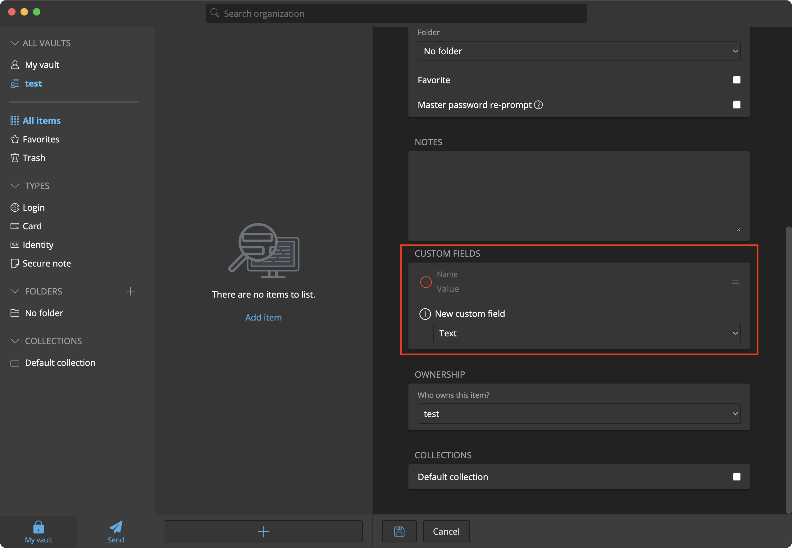

# Bitwarden Environment Variables

Securely use and share environment variables in your local development using [Bitwarden](https://bitwarden.com/)!

## Before Using This Tool

Before using this tool, it is recommended you take a look at [Bitwarden Secrets Manager](https://bitwarden.com/products/secrets-manager/) and see if it fulls your needs. At the time of writing, it is in beta and does not have the ability to replicate this tool's feature set. However, the Bitwarden Secrets Manager CLI is described as ["a powerful tool for retrieving and injecting your secrets"](https://bitwarden.com/help/secrets-manager-cli/), so it may be possible to replicate this tool with their native offering in the future.

## Why Use This Tool

In short, storing your secrets (e.g., API keys, client secrets, etc.) in a plaintext `.env` file is insecure and not portable. If your computer is ever hacked or stolen, the perpetrator will have easy access to this data. Additionally, with any distributed system without a central source of truth, it can be hard to know what the most up-to-date version of any secret is. In other words, when working in a team, storing your secrets in a secrets/passwords manager makes it is much easier to keep everyone in sync. This tool helps bridge the gap between storing these secrets in Bitwarden, and using these secrets in your shell.

## Install

```sh
pip install bwenv
```

This tool requires the [Bitwarden CLI](https://bitwarden.com/help/cli/). Make sure it is on your `PATH` before using this tool (or else you will get a `FileNotFoundError` error).

## Usage

```sh
bwenv [-h] [--session SESSION] {run,generate} ...
```

This tool uses the [Bitwarden CLI](https://bitwarden.com/help/cli/) and needs a session token to access your Bitwarden vault. The session token can be generated by running `bw unlock` and can be passed into this tool by either setting the session token to the `BW_SESSION` environment variable or by using the `--session` flag.

### Setting up Bitwarden

Within Bitwarden, you need to create the item to hold your environment variables. The `type` of the item does not matter, however all environment variables need to add to the `Custom Fields` section and must not have the type `Linked`. Fields with type `Linked` will not have an environment variable created for them.



### `bwenv generate`

```sh
bwenv generate [-h] [-f ENV_FILE] name [name ...]
```

This command is for generating a `.env` file (filename is customizable with the `-f` flag). This will perform either a fuzzy search for the Bitwarden Item Name or ID. The founded environment variables will be appended to file (i.e., this will not overwrite existing data within the file).

### `bwenv run`

```sh
bwenv run [-h] [-f ENV_FILE] command [command ...]
```

This command is for running a command with the environment variables pulled from Bitwarden. `.env` is the default filename and can be customized with the `-f` flag. This will not create environment variables for key-values defined without the `bwenv://` prefix.

## Is it safe to commit the generated `.env`?

You should still avoid committing your `.env`, however if your `.env` is exposed, none of the information in the generated secret reference string is sensitive. You would still need the Bitwarden credentials to make use of this information.

## What about 1Password?

1Password already has native support this for feature, and it is called [Secret References](https://developer.1password.com/docs/cli/secret-references).
